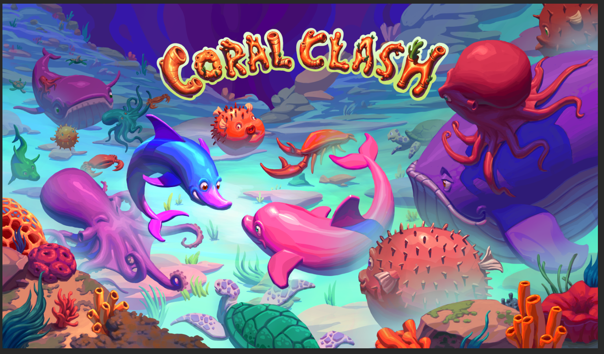

# Coral Clash



An ocean-themed strategy board game built with React Native, Expo, and Firebase.

## About

Coral Clash is a mobile board game application featuring online multiplayer gameplay with ocean-themed pieces. Play against friends or challenge the computer in this chess-like strategy game. Built using React Native with Expo for cross-platform support on iOS and Android.

## Features

- 🎮 **Online Multiplayer** - Challenge friends in real-time PvP matches
- 🤖 **AI Opponents** - Play against computer opponents with varying difficulty
- 👥 **Friends System** - Add friends and track your matchups
- 📊 **Statistics** - Track wins, losses, and win rates against each opponent
- 🎨 **Beautiful UI** - Ocean-themed design with dark/light mode support
- 🔔 **Real-time Notifications** - Get notified of game invites and moves
- 🚀 **CI/CD Pipeline** - Automated testing and deployment via GitHub Actions
- 📱 **Cross-Platform** - Native iOS and Android apps via Expo

## Prerequisites

- Node.js 22+ (LTS) or Node.js 24+
- Yarn package manager
- Expo CLI
- iOS Simulator (for macOS) or Android Emulator
- Firebase account (for backend services)

## Quick Start

### 1. Install Dependencies

```bash
yarn install
cd functions && yarn install
```

### 2. Start the Development Server

```bash
yarn start
```

This will start the Expo development server and open the Expo DevTools in your browser.

### 3. Run on a Device

**iOS Simulator (macOS only):**

```bash
yarn ios
```

**Android Emulator:**

```bash
yarn android
```

**Physical Device:**

1. Install the Expo Go app on your phone
2. Scan the QR code shown in the terminal or Expo DevTools

## Tech Stack

### Frontend

- **Expo SDK 54** - Development framework
- **React Native 0.81.5** - Mobile app framework
- **React 19.1** - UI library
- **React Navigation v7** - Navigation and routing
- **TypeScript 5.9** - Type safety for game logic
- **Galio Framework** - UI component library

### Backend

- **Firebase Cloud Functions** - Serverless backend (Node.js 22)
- **Firestore** - NoSQL database
- **Firebase Authentication** - User authentication with Google Sign-In
- **Firebase Cloud Messaging** - Push notifications

### DevOps & Tooling

- **Expo Application Services (EAS)** - Build and submit automation
- **GitHub Actions** - CI/CD pipeline for testing and deployment
- **Firebase CLI** - Backend deployment and emulators
- **Jest** - Testing framework for all layers
- **Yarn Workspaces** - Monorepo dependency management

## Project Structure

```text
coral_clash/
├── .github/                   # GitHub Actions workflows
│   └── workflows/            # CI/CD pipeline definitions
│       ├── test.yml          # Automated testing
│       ├── deploy-staging.yml # Staging deployment
│       ├── deploy.yml        # Production deployment
│       └── firebase-deploy.yml # Firebase backend deployment
├── src/                       # Main source code
│   ├── components/           # Reusable UI components
│   │   ├── BaseCoralClashBoard.js    # Base board component
│   │   ├── PvPCoralClashBoard.js     # Multiplayer board
│   │   ├── ComputerCoralClashBoard.js # AI opponent board
│   │   ├── ActiveGamesCard.js # Active games display
│   │   ├── Avatar.js         # User avatar component
│   │   ├── GameModeCard.js   # Game mode selection
│   │   ├── MatchmakingCard.js # Matchmaking UI
│   │   └── ...               # 22 components total
│   ├── screens/              # Screen components
│   │   ├── Home.js           # Home screen with game modes
│   │   ├── Game.js           # Game screen
│   │   ├── Friends.js        # Friends management
│   │   ├── Stats.js          # Statistics and analytics
│   │   ├── Settings.js       # User settings
│   │   ├── Login.js          # Authentication
│   │   ├── HowToPlay.js      # Game rules/tutorial
│   │   └── ScenarioBoard.js  # Tutorial scenarios
│   ├── hooks/                # Custom React hooks
│   │   ├── useCoralClash.ts  # Core game logic hook
│   │   ├── useGame.js        # Game state management
│   │   ├── useGameActions.js # Game action handlers
│   │   ├── useMatchmaking.js # Matchmaking logic
│   │   ├── useFriends.js     # Friends management
│   │   ├── useFirebaseFunctions.js # Firebase API calls
│   │   └── ...               # 10 hooks total
│   ├── navigation/           # Navigation configuration
│   │   ├── Screens.js        # Main drawer navigator
│   │   └── Menu.js           # Custom drawer content
│   ├── contexts/             # React contexts
│   │   ├── AuthContext.js    # Authentication state
│   │   ├── ThemeContext.js   # Theme (dark/light mode)
│   │   └── NotificationContext.js # Notification handling
│   ├── config/               # Configuration files
│   │   └── firebase.js       # Firebase initialization
│   ├── constants/            # App constants
│   │   ├── theme.js          # Theme colors and styles
│   │   ├── avatars.js        # Avatar configurations
│   │   ├── images.js         # Image imports
│   │   └── tutorialScenarios.js # Tutorial game states
│   └── assets/               # Static assets
│       ├── images/           # PNG image assets
│       ├── icons/            # App icons
│       └── fonts/            # Custom fonts
├── functions/                # Firebase Cloud Functions
│   ├── routes/              # API route handlers
│   │   ├── game.js          # PvP/Computer game API
│   │   ├── matchmaking.js   # Matchmaking API
│   │   ├── friends.js       # Friends management API
│   │   ├── userProfile.js   # User profiles API
│   │   └── userSettings.js  # User settings API
│   ├── triggers/            # Firestore triggers
│   │   ├── onGameMoveUpdate.js # Game move notifications
│   │   ├── onPlayerJoinQueue.js # Matchmaking triggers
│   │   └── onUserCreate.js  # New user initialization
│   ├── scheduled/           # Scheduled functions
│   │   └── cleanupStaleMatchmakingEntries.js
│   ├── utils/               # Utility functions
│   │   ├── gameValidator.js # Server-side move validation
│   │   ├── helpers.js       # Helper functions
│   │   └── notifications.js # Push notification logic
│   └── __tests__/           # Function tests
├── shared/                  # Shared code between frontend and backend
│   └── game/                # Core game engine (TypeScript)
│       ├── v1.0.0/          # Versioned game logic
│       │   ├── coralClash.ts # Game state logic
│       │   ├── gameState.ts  # Game state types
│       │   └── index.ts
│       ├── __tests__/       # Game engine tests
│       ├── __fixtures__/    # Test fixtures
│       └── index.ts         # Public exports
├── docs/                    # Comprehensive documentation
│   ├── architecture.md      # System architecture
│   ├── coral_clash_rules.md # Game rules
│   ├── github_actions_setup.md # CI/CD setup
│   ├── firebase_setup.md    # Firebase configuration
│   └── ...                  # 17 docs total
├── android/                 # Android native code
├── ios/                     # iOS native code
├── App.js                   # App entry point
├── eas.json                 # EAS Build configuration
├── firebase.json            # Firebase configuration
├── firestore.rules          # Firestore security rules
├── firestore.indexes.json   # Firestore indexes
└── package.json             # Dependencies and scripts
```

## Development

### Working with the Shared Game Engine

The core game logic is in the `@jbuxofplenty/coral-clash` package, which is published to GitHub Packages and used by both the client and server.

**For local development with unpublished changes:**

```bash
# Link local shared package for development
yarn dev:link

# Make changes to shared/game/* and test locally
cd shared && yarn build && cd ..

# When done testing, unlink and reinstall from registry
yarn dev:unlink
```

**Important Notes:**

- Always unlink before committing: `yarn dev:unlink`
- Never commit with a linked version - always use the published package
- Changes to `shared/game/` trigger automatic version bumps and publishing when pushed to `develop`

**Version Bump Triggers (via Conventional Commits):**

- `feat(shared):` → MINOR version bump (1.0.0 → 1.1.0) - new features
- `fix(shared):` → PATCH version bump (1.0.0 → 1.0.1) - bug fixes
- `feat(shared)!:` or `BREAKING CHANGE:` → MAJOR version bump (1.0.0 → 2.0.0) - breaking changes

Example:

```bash
git commit -m "feat(shared): add support for tournament mode"
# Results in automatic MINOR version bump when pushed to develop
```

### Running Tests

**Frontend tests:**

```bash
yarn test
```

**Backend tests:**

```bash
cd functions && yarn test
```

**Run all tests (CI):**

```bash
yarn test:ci
cd functions && yarn test:ci
```

### Firebase Emulators

Run Firebase services locally:

```bash
firebase emulators:start
```

### TypeScript

- **Strict type checking** enabled for game logic
- **Mixed codebase**: TypeScript for core game, JavaScript for UI

### Native Development Builds

For testing on physical iOS devices with native modules or when you need a development build (instead of Expo Go):

```bash
npx expo prebuild --platform ios --clean && npx expo run:ios --device
```

**When to use this command:**

- Testing on a physical iOS device with native modules that don't work in Expo Go
- After making changes to native configuration (app.json, plugins, or native code)
- When experiencing iOS build issues and need a clean rebuild of native directories
- Testing push notifications or other native features that require a development build
- Debugging native module integration issues

**Note:** This command will:

1. Clean and regenerate the `ios/` directory (removes existing native code)
2. Build and install the app on a connected physical iOS device
3. Requires Xcode and a connected iOS device via USB

**Alternative for Android:**

```bash
npx expo prebuild --platform android --clean && npx expo run:android --device
```

### Development Features

- **Hot Reload** - Changes update instantly during development
- **Cross-platform** - Single codebase for iOS and Android
- **Server-side validation** - Prevents cheating in multiplayer games

## CI/CD & Deployment

The project uses GitHub Actions for automated testing and deployment.

### Automated Workflows

#### 1. **Continuous Testing** (`test.yml`)

Runs on every push to `main` and on all pull requests:

- ✅ Tests frontend, shared module, and backend functions
- ✅ Validates build integrity
- ✅ Uses Node.js 22 (Firebase Cloud Functions requirement)

#### 2. **Staging Deployment** (`deploy-staging.yml`)

Deploys to TestFlight (iOS) and Internal Testing (Android):

**Triggers:**

- Push to `develop` branch
- Tags matching `v*-beta.*` or `v*-rc.*` (e.g., `v1.8.0-beta.1`)
- Manual trigger via GitHub Actions UI

**Process:**

- Builds using EAS Build with `preview` profile
- Submits to TestFlight (iOS) and Internal Testing track (Android)
- Uses `internal` distribution for pre-release testing

#### 3. **Production Deployment** (`deploy.yml`)

Deploys to App Store (iOS) and Play Store (Android):

**Triggers:**

- Tags matching semantic versioning: `v[major].[minor].[patch]` (e.g., `v1.8.0`)
- Manual trigger via GitHub Actions UI

**Process:**

- Builds using EAS Build with `production` profile
- Submits to App Store and Play Store for public release
- Requires approval in GitHub environment `production`

#### 4. **Firebase Backend Deployment** (`firebase-deploy.yml`)

Deploys backend services (Cloud Functions, Firestore rules, indexes):

**Triggers:**

- Automatically after successful staging deployment
- Manual trigger with selective deployment options

**Process:**

- Builds and tests shared game module
- Runs functions tests before deployment
- Deploys to Firebase project `coral-clash`
- Supports selective deployment: `functions`, `firestore`, `hosting`, or `all`

### Manual Deployments

**Deploy to Staging:**

```bash
# Via GitHub Actions UI: Actions → Deploy to Staging → Run workflow

# Or via CLI:
yarn build:staging        # Build both platforms
yarn build:staging:ios    # iOS only
yarn build:staging:android # Android only
yarn submit:staging       # Submit latest builds
```

**Deploy to Production:**

```bash
# Via GitHub Actions UI: Actions → Deploy to Production → Run workflow

# Or via CLI:
yarn build:production        # Build both platforms
yarn build:production:ios    # iOS only
yarn build:production:android # Android only
yarn submit:production       # Submit latest builds
```

**Deploy Firebase:**

```bash
# Via GitHub Actions UI: Actions → Deploy to Firebase → Run workflow

# Or via CLI:
firebase deploy --project coral-clash
firebase deploy --only functions --project coral-clash
firebase deploy --only firestore --project coral-clash
```

### Release Process

**Staging Release (with automatic package versioning):**

```bash
# 1. Merge changes to develop branch with conventional commit
git checkout develop
git merge feature/my-feature

# 2. Push to develop - triggers automatic package release
git push origin develop

# 3. GitHub Actions automatically:
#    - Releases new @jbuxofplenty/coral-clash version (if commits include feat/fix(shared))
#    - Runs tests
#    - Builds and submits to TestFlight/Internal Testing
#    - Deploys Firebase backend
```

**Staging Release (manual tag):**

```bash
# 1. Tag with beta version (skips package release)
git tag v1.8.0-beta.1
git push origin v1.8.0-beta.1

# 2. GitHub Actions builds and submits to TestFlight/Internal Testing
```

**Production Release:**

```bash
# 1. Merge develop to main
git checkout main
git merge develop

# 2. Tag with production version
git tag v1.8.0
git push origin v1.8.0

# 3. GitHub Actions automatically builds and submits to App Store/Play Store
# Note: Uses already-published @jbuxofplenty/coral-clash version from develop
```

### Required GitHub Secrets

Configure these secrets in **Settings → Secrets and variables → Actions**:

- `EXPO_TOKEN` - Expo authentication token (get via `npx eas login` then `npx eas token:create`)
- `FIREBASE_TOKEN` - Firebase CI token (get via `firebase login:ci`)

### EAS Build Configuration

The project uses Expo Application Services (EAS) for building and submitting apps:

- **Development**: Local development builds with dev client
- **Preview**: Internal testing builds (TestFlight/Internal Testing track)
- **Production**: Public release builds (App Store/Play Store)

See `eas.json` for detailed build configuration.

## Troubleshooting

**Clear cache and restart:**

```bash
expo start -c
```

**Reinstall dependencies:**

```bash
rm -rf node_modules
yarn install
cd functions && rm -rf node_modules && yarn install
```

**iOS build issues:**

```bash
# Clean and regenerate native iOS directories
npx expo prebuild --platform ios --clean && npx expo run:ios --device

# Or if you just need to reinstall pods:
cd ios
pod install
cd ..
```

**Android build issues:**

```bash
# Clean and regenerate native Android directories
npx expo prebuild --platform android --clean && npx expo run:android --device
```

**Firebase emulator issues:**

```bash
rm -rf .emulator-data/
firebase emulators:start --clean
```

## Documentation

Comprehensive documentation is available in the `docs/` directory:

### Game & Architecture

- [Coral Clash Rules](docs/coral_clash_rules.md) - Complete game rules and mechanics
- [Architecture Overview](docs/architecture.md) - System architecture and design patterns
- [Game Actions Architecture](docs/game_actions_architecture.md) - Action handling and validation
- [Game Versioning](docs/game_versioning.md) - Version management strategy

### Feature Documentation

- [Active Games Feature](docs/active_games_feature.md) - Active games display and management
- [Matchmaking System](docs/matchmaking_system.md) - Matchmaking logic and cleanup
- [Notification System](docs/notification_system.md) - Push notification implementation
- [Computer Game API](docs/computer_game_api.md) - AI opponent integration
- [Tutorial Autoplay](docs/tutorial_autoplay_feature.md) - Tutorial and autoplay features

### Setup & Deployment Guides

- [Firebase Setup](docs/firebase_setup.md) - Firebase project configuration
- [Google Sign-In Setup](docs/google_signin_setup.md) - OAuth configuration
- [GitHub Actions Setup](docs/github_actions_setup.md) - CI/CD configuration
- [Deployment Quick Reference](docs/deployment_quick_reference.md) - Quick deployment commands
- [Deployment Setup](docs/deployment_setup.md) - Detailed deployment guide

### Debugging & Maintenance

- [Game State Debug](docs/game_state_debug.md) - Debugging game state issues
- [Matchmaking Cleanup](docs/matchmaking_cleanup.md) - Matchmaking maintenance

## License

Licensed under MIT
