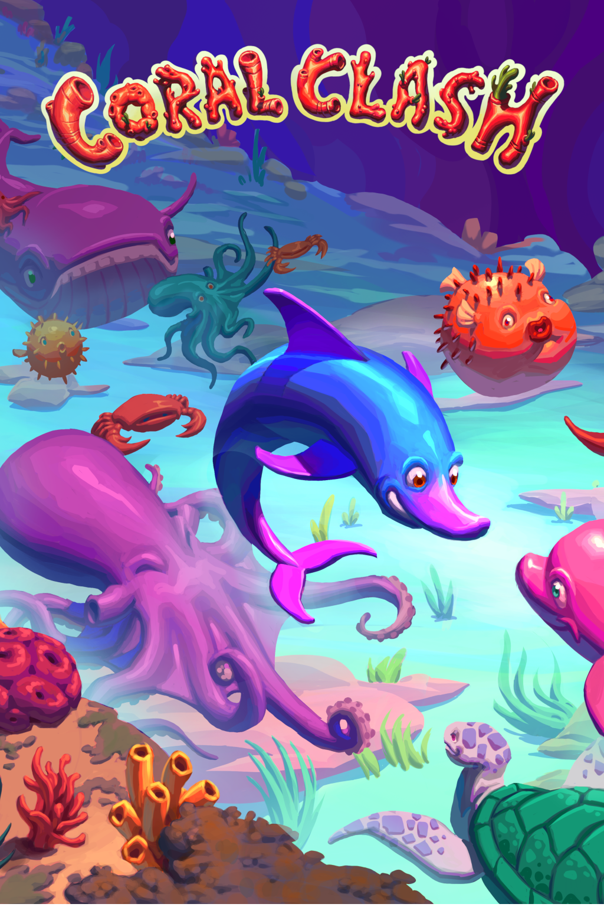

# Coral Clash



An ocean-themed strategy board game built with React Native, Expo, and Firebase.

## About

Coral Clash is a mobile board game application featuring online multiplayer gameplay with ocean-themed pieces. Play against friends or challenge the computer in this chess-like strategy game. Built using React Native with Expo for cross-platform support on iOS and Android.

## Features

- 🎮 **Online Multiplayer** - Challenge friends in real-time PvP matches
- 🤖 **AI Opponents** - Play against computer opponents with varying difficulty
- 👥 **Friends System** - Add friends and track your matchups
- 📊 **Statistics** - Track wins, losses, and win rates against each opponent
- 🎨 **Beautiful UI** - Ocean-themed design with dark/light mode support
- 🔔 **Real-time Notifications** - Get notified of game invites and moves

## Prerequisites

- Node.js 22+ (LTS) or Node.js 24+
- Yarn package manager
- Expo CLI
- iOS Simulator (for macOS) or Android Emulator
- Firebase account (for backend services)

## Quick Start

### 1. Install Dependencies

```bash
yarn install
cd functions && yarn install
```

### 2. Start the Development Server

```bash
yarn start
```

This will start the Expo development server and open the Expo DevTools in your browser.

### 3. Run on a Device

**iOS Simulator (macOS only):**

```bash
yarn ios
```

**Android Emulator:**

```bash
yarn android
```

**Physical Device:**

1. Install the Expo Go app on your phone
2. Scan the QR code shown in the terminal or Expo DevTools

## Tech Stack

### Frontend

- **Expo SDK 54** - Development framework
- **React Native 0.76** - Mobile app framework
- **React Navigation v7** - Navigation and routing
- **TypeScript** - Type safety for game logic
- **Galio Framework** - UI component library

### Backend

- **Firebase Cloud Functions** - Serverless backend
- **Firestore** - NoSQL database
- **Firebase Authentication** - User authentication with Google Sign-In
- **Firebase Cloud Messaging** - Push notifications

## Project Structure

```
coral_clash/
├── src/                        # Main source code
│   ├── components/            # Reusable UI components
│   │   ├── CoralClashBoard.js # Game board component
│   │   ├── Avatar.js          # User avatar component
│   │   ├── ActiveGamesCard.js # Active games display
│   │   └── ...
│   ├── screens/               # Screen components
│   │   ├── Home.js            # Home screen with game modes
│   │   ├── Game.js            # Game screen
│   │   ├── Friends.js         # Friends management
│   │   ├── Stats.js           # Statistics and analytics
│   │   ├── Settings.js        # User settings
│   │   └── Login.js           # Authentication
│   ├── hooks/                 # Custom React hooks
│   │   ├── useCoralClash.ts   # Core game logic hook
│   │   ├── usePvPGame.js      # Multiplayer game hook
│   │   └── useFirebaseFunctions.js
│   ├── navigation/            # Navigation configuration
│   │   ├── Screens.js         # Main drawer navigator
│   │   └── Menu.js            # Custom drawer content
│   ├── contexts/              # React contexts
│   │   ├── AuthContext.js     # Authentication state
│   │   ├── ThemeContext.js    # Theme (dark/light mode)
│   │   └── NotificationContext.js
│   ├── config/                # Configuration files
│   │   └── firebase.js        # Firebase initialization
│   ├── constants/             # App constants
│   │   ├── Theme.js           # Theme colors and styles
│   │   ├── avatars.js         # Avatar configurations
│   │   └── products.js        # Game mode definitions
│   └── assets/                # Static assets
│       ├── images/            # Image assets
│       └── fonts/             # Custom fonts
├── functions/                 # Firebase Cloud Functions
│   ├── routes/               # API route handlers
│   │   ├── game.js           # PvP/Computer game logic
│   │   ├── friends.js        # Friends management
│   │   ├── userProfile.js    # User profiles
│   │   └── userSettings.js   # User settings
│   ├── utils/                # Utility functions
│   │   ├── gameValidator.js  # Server-side move validation
│   │   ├── helpers.js        # Helper functions
│   │   └── notifications.js  # Push notification logic
│   └── __tests__/            # Function tests
├── shared/                   # Shared code between frontend and backend
│   └── game/                 # Core game engine
│       ├── coralClash.ts     # Game state logic
│       └── gameState.ts      # Game state types
├── docs/                     # Documentation
└── ios/                      # iOS native code
```

## Development

### Running Tests

**Frontend tests:**

```bash
yarn test
```

**Backend tests:**

```bash
cd functions && yarn test
```

**Run all tests (CI):**

```bash
yarn test:ci
cd functions && yarn test:ci
```

### Firebase Emulators

Run Firebase services locally:

```bash
firebase emulators:start
```

### TypeScript

- **Strict type checking** enabled for game logic
- **Mixed codebase**: TypeScript for core game, JavaScript for UI

### Development Features

- **Hot Reload** - Changes update instantly during development
- **Cross-platform** - Single codebase for iOS and Android
- **Server-side validation** - Prevents cheating in multiplayer games

## Troubleshooting

**Clear cache and restart:**

```bash
expo start -c
```

**Reinstall dependencies:**

```bash
rm -rf node_modules
yarn install
cd functions && rm -rf node_modules && yarn install
```

**iOS build issues:**

```bash
cd ios
pod install
cd ..
```

**Firebase emulator issues:**

```bash
rm -rf .emulator-data/
firebase emulators:start --clean
```

## Game Rules

For detailed game rules and mechanics, see [docs/coral_clash_rules.md](docs/coral_clash_rules.md)

## License

Licensed under MIT
